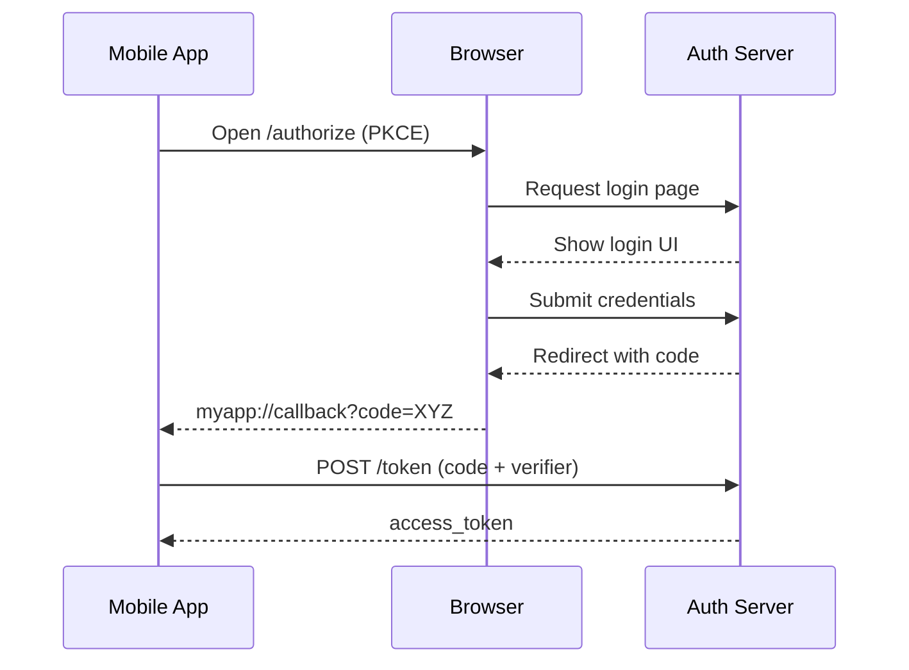

# Authentication Flow

## Step-by-step

1. Mobile app initiates login and generates PKCE values.
2. Browser opens authorization entry (`/login` -> `/api/authorize`).
3. User logs in on the web page.
4. Server generates an authorization code.
5. Server redirects to the deep link callback URI.
6. Mobile app receives `myapp://callback?code=...`.
7. Mobile app calls `/api/token` with `code` + `code_verifier`.
8. Server recomputes and validates PKCE challenge.
9. Server returns an access token.
10. Mobile app stores token and navigates to dashboard.

## Sequence Diagram

