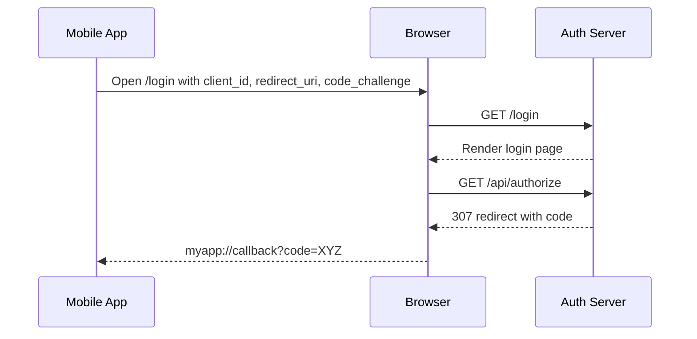
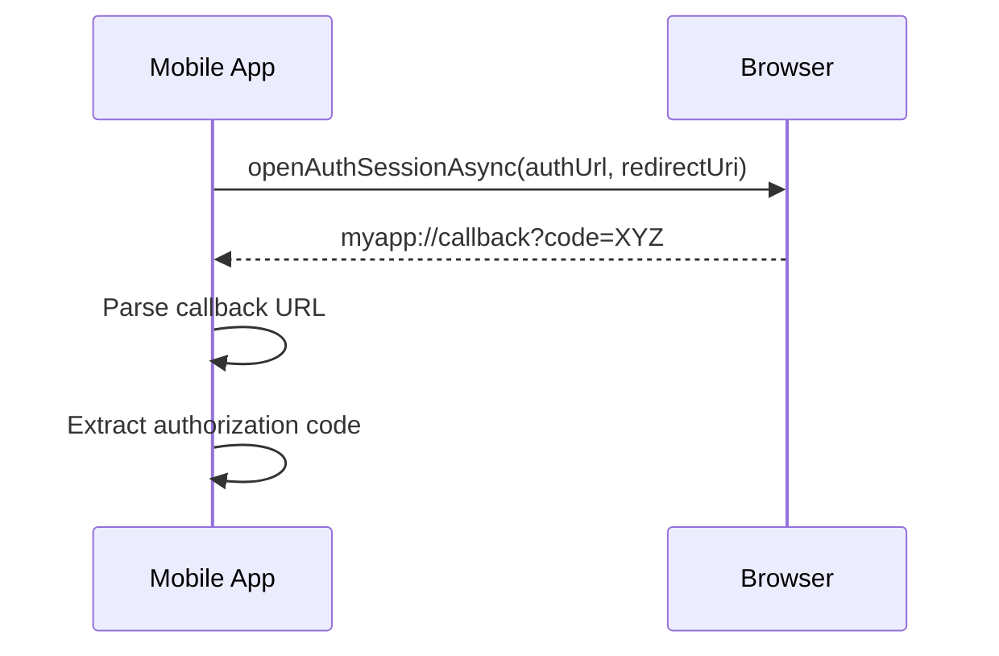
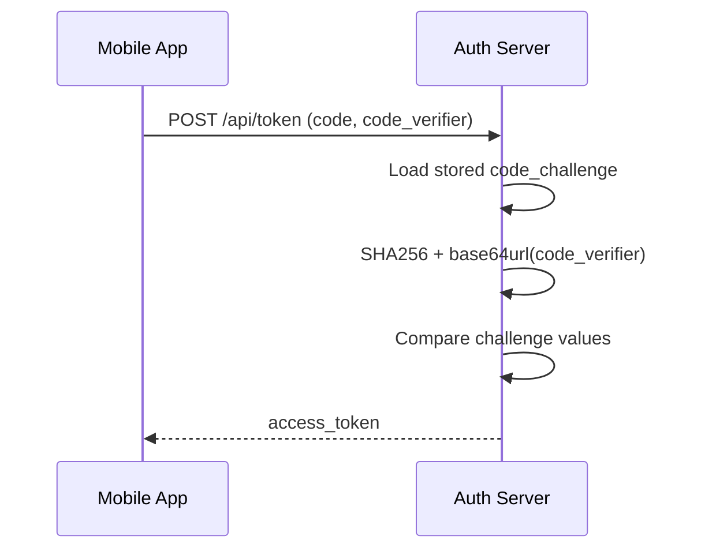

# Sequence Diagrams

## 1) Basic PKCE Flow

```mermaid
sequenceDiagram
    participant Mobile App
    participant Browser
    participant Auth Server

    Mobile App->>Browser: Open /login with client_id, redirect_uri, code_challenge
    Browser->>Auth Server: GET /login
    Auth Server-->>Browser: Render login page
    Browser->>Auth Server: GET /api/authorize
    Auth Server-->>Browser: 307 redirect with code
    Browser-->>Mobile App: myapp://callback?code=XYZ
```

## 2) Deep Linking Flow

```mermaid
sequenceDiagram
    participant Mobile App
    participant Browser

    Mobile App->>Browser: openAuthSessionAsync(authUrl, redirectUri)
    Browser-->>Mobile App: myapp://callback?code=XYZ
    Mobile App->>Mobile App: Parse callback URL
    Mobile App->>Mobile App: Extract authorization code
```

## 3) Token Exchange Flow

```mermaid
sequenceDiagram
    participant Mobile App
    participant Auth Server

    Mobile App->>Auth Server: POST /api/token (code, code_verifier)
    Auth Server->>Auth Server: Load stored code_challenge
    Auth Server->>Auth Server: SHA256 + base64url(code_verifier)
    Auth Server->>Auth Server: Compare challenge values
    Auth Server-->>Mobile App: access_token
```
