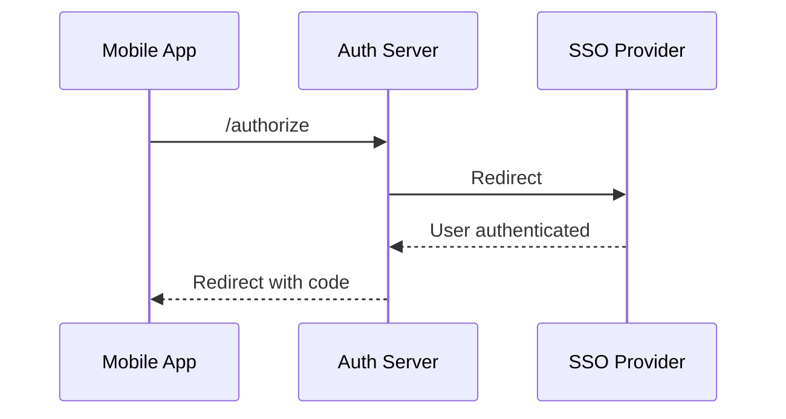

# SSO Simulation

## What is SSO?

Single Sign-On lets a user authenticate once with an identity provider and reuse that identity across connected applications.

## How identity providers work

1. User is redirected from app/auth server to IdP.
2. IdP authenticates user.
3. IdP redirects back with identity context.
4. Authorization server continues OAuth flow.

## Role separation in this demo

- **OAuth client**: `apps/mobile-app`
- **Authorization server**: `apps/auth-server` (`/api/authorize`, `/api/token`)
- **Identity provider (mock)**: `apps/auth-server` (`/sso-provider`, `/api/sso-provider`)

## SSO flow in this project

1. User taps `Login with SSO` on `/login`.
2. Auth server redirects to `/sso-provider`.
3. User clicks `Login with Google (Mock)`.
4. `/api/sso-provider` generates mock `id` and `email`.
5. Endpoint redirects to `/api/authorize`.
6. `/api/authorize` issues authorization code.
7. Mobile app exchanges code at `/api/token`.

## Mermaid diagram

